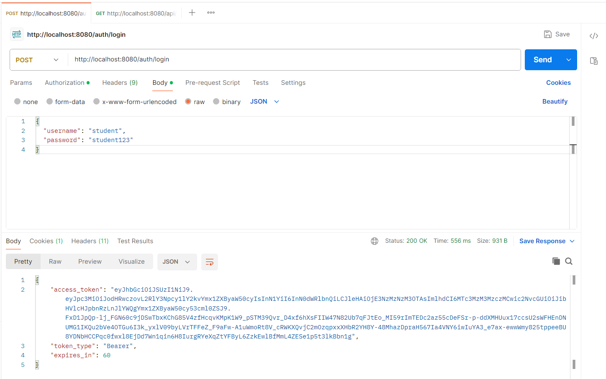
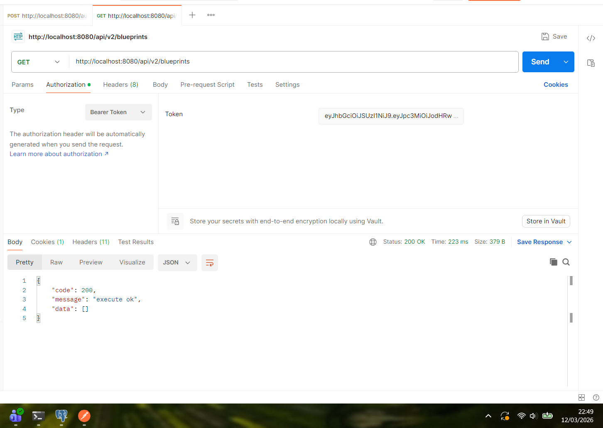
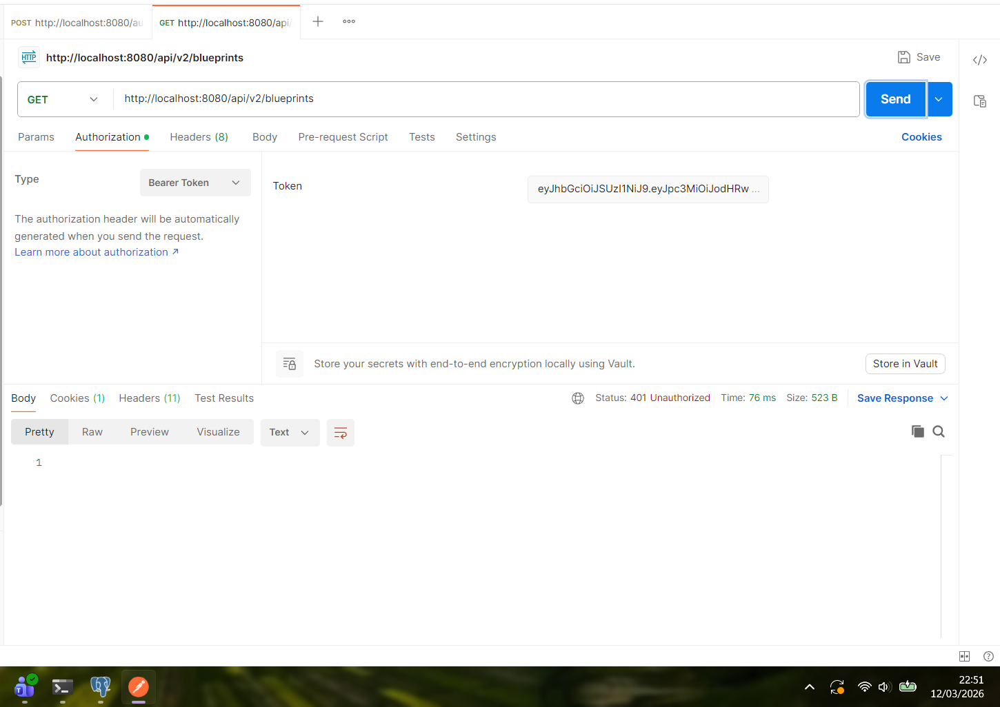
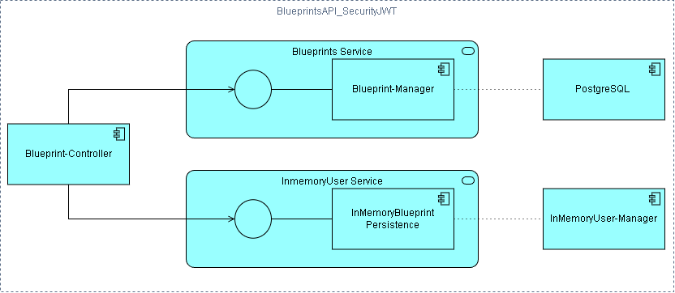

## Laboratorio – Parte 2: BluePrints API con Seguridad JWT (OAuth 2.0)

### 1. Revisión del código de configuración de seguridad 

En el archivo `SecurityConfig`, el método clave es el bean filterChain. Este es el que define la política de acceso:

- **Endpoints públicos:**
Se definen con `.permitAll()`:

  - `/auth/login`: para que el usuario pueda autenticarse.
  - `/actuator/health`: para monitoreo del estado de la app.
  - `/v3/api-docs/**`, `/swagger-ui/**`: para que la documentación sea accesible sin token.
 
- **Endpoints protegidos:**
Se definen con `.requestMatchers("/api/**")`:

  - Cualquier petición a una URL que empiece por `/api/` requiere obligatoriamente que el token presente una autoridad (scope).
  - `hasAnyAuthority("SCOPE_blueprints.read", "SCOPE_blueprints.write")`: el prefijo SCOPE_ lo añade Spring automáticamente al leer la claim "scope" del JWT.

### 2. Flujo del login y claims del JWT emitido

Revisando el archivo `AuthController`, el flujo de autenticación sería:

- El usuario envía un `POST /auth/login` con su username y password.

- El controlador consulta el servicio de usuarios `InMemoryUserService` para verificar si las credenciales son correctas. Si no lo son responde con 401 Unauthorized y un mensaje de error.

- Si las credenciales son válidas:

  - Se calcula el tiempo actual (issuedAt) y el tiempo de expiración (expiresAt) según la configuración (tokenTtlSeconds).
  - Se definen los permisos (scope) que tendrá el token.
  - Se construye el conjunto de claims (`JwtClaimsSet`) con la información del usuario y la configuración.
  - Se firma el token con el algoritmo RS256.

- El servidor devuelve un objeto con el access_token (el JWT), el tipo de token (Bearer) y el tiempo de expiración.

Por otro lado, los claims del JWT son:

- issuer: identifica quién emitió el token.

- issuedAt: momento en que se generó el token.

- expiresAt: momento en que expira el token.

- subject: el nombre de usuario autenticado.

- scope (custom claim): lista de permisos asociados al token, en este caso "blueprints.read blueprints.write".

### 3. Extensión de scopes

En esta etapa se integró la lógica de negocio de la parte 1 del laboratorio con la parte 2.

Cambios realizados:
* **Seguridad de método:** se implementaron las anotaciones `@PreAuthorize` en el controlador `BlueprintsController` para restringir el acceso según los privilegios del usuario.
* **Definición de scopes:**
    * `blueprints.read`: requerido para todos los endpoints de consulta (`GET`).
    * `blueprints.write`: requerido para la creación y modificación de planos (`POST`, `PUT`).

Ejemplo de uso:
* **Obtener token:** `POST /auth/login` con credenciales válidas.
* **Consumir API:** Usar el token como `Bearer Token` en la cabecera de la petición hacia `/api/v2/blueprints`.

### 4. Modificación del tiempo de expiración del token

Se configuró el tiempo de vida de los tokens JWT. 

- Configuración: `token-ttl-seconds: 60`
- Verificación: Se comprobó mediante Postman que, tras superar los 60 segundos de inactividad del token, el servidor de recursos rechaza las peticiones, obligando a una nueva autenticación.

Aquí se hace el login en Postman (POST /auth/login) y se copia el token.

Se usa el GET y el Status es 200 OK.

Se espera un minuto. Se vuelve a dar a Send en Postman con el mismo token. Y devuelve 401 Unauthorized.

### 5. Documentación de endpoints de negocio y de autenticación

Se encuentra disponible en http://localhost:8080/swagger-ui/index.html

### Diagrama de componentes

---
## Laboratorio – Parte 4: BluePrints en Tiempo Real

### Estado de la funcionalidad en tiempo real
Se implementó la base técnica para STOMP sobre WebSocket, incluyendo publicación de eventos a `/app/draw` y suscripción por plano en `/topic/blueprints.{author}.{name}`. Sin embargo, durante la validación integral no se logró una sincronización estable entre clientes (dos pestañas) bajo las condiciones esperadas del laboratorio, por lo que la funcionalidad de colaboración en vivo queda reportada como **parcial / no completada** en esta entrega.

### Flujo funcional implementado
El estado inicial del plano se obtiene por REST al abrirlo en la UI. El canvas permite interacción por clic para agregar puntos y visualizar el trazado. Las operaciones CRUD (Create / Save-Update / Delete) actualizan la lista de planos del autor y recalculan el total de puntos mostrado en el panel.

### Manejo de sesión y permisos en UI
La interfaz contempla controles de sesión para operaciones sensibles y para el modo de tiempo real. En ausencia de autenticación, se prioriza evitar cambios no autorizados y mantener consistencia entre estado visual y estado persistido. Se realizaron ajustes en validaciones de interacción y consumo de servicios para reducir estados ambiguos en la UI.

### Pruebas realizadas
Se validó correctamente la carga inicial del plano desde REST, el dibujo incremental en canvas y las operaciones CRUD con refresco de lista y total de puntos por autor.  
En tiempo real, se probaron escenarios de conexión STOMP, suscripción por tópico y envío de eventos; no obstante, la replicación multi-pestaña no alcanzó estabilidad suficiente para considerarse completada.

### Hallazgos y lecciones aprendidas
Los principales bloqueos de RT estuvieron asociados a autenticación/sesión, configuración de backend en ejecución, puertos/orígenes en desarrollo y acoplamiento entre estado local y eventos remotos. Se evidenció la importancia de separar claramente el flujo REST del flujo RT, mejorar trazabilidad de eventos y fortalecer manejo de reconexión y errores para depurar colaboración distribuida.

### Conclusión
La solución cumple satisfactoriamente la parte CRUD del Lab P4 y deja implementada la base de integración para tiempo real. La colaboración en vivo no se logró estabilizar en esta iteración, por lo que se documenta explícitamente como pendiente técnico para una siguiente mejora.
